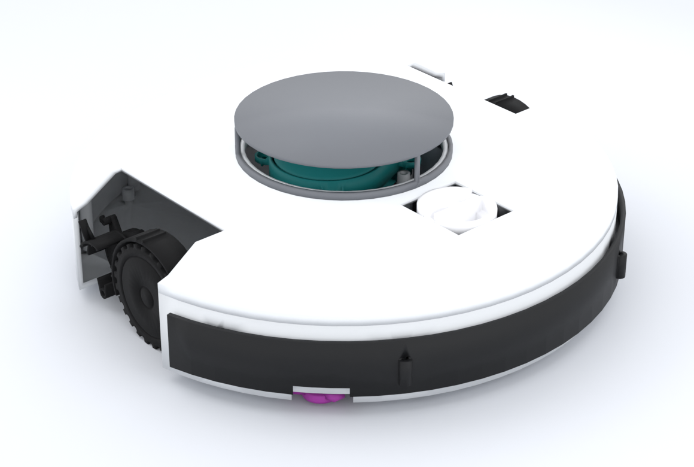

# Agentic CAD experiment (July 2026)

An early experiment for OOMWOO One: we tried an agentic CAD pipeline to see how far it could get. An LLM-driven multi-agent workflow was asked to turn the project spec and a set of component STEP files into a complete, closed, 3D-printable robot vacuum, written entirely as code-CAD.

This folder is a snapshot of that experiment, shared as-is in the build-in-public spirit of the project.

> **This is not the OOMWOO One design.** It is unreviewed pipeline output from a single revision ("RV02") and has known design errors, listed below. The actual design work lives in [`designs/one/stock/`](../../stock) and [`lib/`](../../../../lib).

## Contents

| File | What it is |
|---|---|
| [`OOMWOO_Device_RV02_Report.pdf`](OOMWOO_Device_RV02_Report.pdf) | 9-page report written by the pipeline: layout, enclosure, verification numbers, print and assembly notes, limitations |
| [`device_full.step`](device_full.step) | Full assembly of that revision: 15 placed components plus the generated base, cover, LiDAR turret cap, bumper, dustbin and battery door (15.6 MB) |
| `device_iso.png` | Render of the closed device, taken from the report |
| `device_full.png` | The same revision with the cover off, showing the component packing |

## How it was made

- **Tooling:** [Claude Code](https://claude.com/claude-code) with Claude Fable 5 orchestrating a multi-agent loop: a designer agent wrote the geometry, and a separate QA agent re-measured the built solids before each phase was accepted.
- **CAD kernel:** [build123d](https://github.com/gumyr/build123d) 0.10.0 on OpenCascade. All geometry is Python code; no GUI CAD was used.
- **Inputs:** the project spec, the LiDAR and compute-module STEP files from [`lib/`](../../../../lib), and stand-in geometry from an older robot vacuum for the parts that had not been 3D-scanned yet.
- **When:** 23-25 July 2026. `device_full.step` is the direct pipeline export of 24 July; nothing in it was edited by hand.

## What worked

- Importing real component STEP files into one coordinate frame and packing 15 of them inside a Ø355 mm envelope with zero boolean interference.
- Generating a base, domed cover, turret cap and front bumper around those components, with numeric gates (interference, clearances, parting-line gap, bumper travel, overall height) checked on the final solids rather than on the generator's intent.
- Swapping one component for another (for example one LiDAR for a different model) with a one-line registry change and regenerating the chassis around it.
- Producing the report, sections and renders automatically from the same model.

## What did not

Every gate the pipeline set for itself passed, and the report says so. What it had no gate for was design intent: which way up a part goes, and whether the layout makes sense as a robot vacuum. Human review of this revision found:

- Side brush mounted sideways and upside down; caster wheel upside down; rubber push-button cover upside down.
- LiDAR puck off-centre, inside an oversized turret.
- Suction fan on the opposite side of the robot from the main brush.
- A round port in the floor with no airflow path designed around it.
- Bumper attached outside the cylindrical body, with its mounts exposed on the exterior.
- Battery-compartment door smaller than the battery, and the battery itself a stand-in rather than the Roborock pack in the BOM.
- No mop.

The takeaway at the time: the pipeline was dependable at what can be measured (fit, clearance, interference, print-bed limits) and unreliable at what has to be understood (orientation, function, layout). Output like this needs a person to review it before it is treated as a design.

## Credits and license

Experiment by Muhammed Ikbal Arikan ([@mikbalarikan](https://github.com/mikbalarikan)) as part of the OOMWOO One CAD work. Released under the repository's [Apache-2.0 license](../../../../LICENSE).
